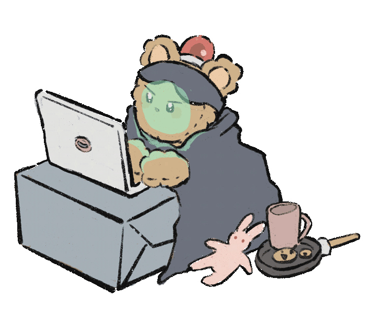

  <h2> Welcome👋 </h2>

 
  
<h5> 🌱 I’m currently learning: JavaScript / React / Unreal Engine / Unity </h5>
  <h5> TRY TO LEARN : ML,DL </h5>

  
 

  
  
  

  
  
<!--
**SooyeonBang/SooyeonBang** is a ✨ _special_ ✨ repository because its `README.md` (this file) appears on your GitHub profile.

Here are some ideas to get you started:

- 🔭 I’m currently working on ...
- 🌱 I’m currently learning 
- 👯 I’m looking to collaborate on ...
- 🤔 I’m looking for help with ...
- 💬 Ask me about ...
- 📫 How to reach me: ...
- 😄 Pronouns: ...
- ⚡ Fun fact: ...
-->
